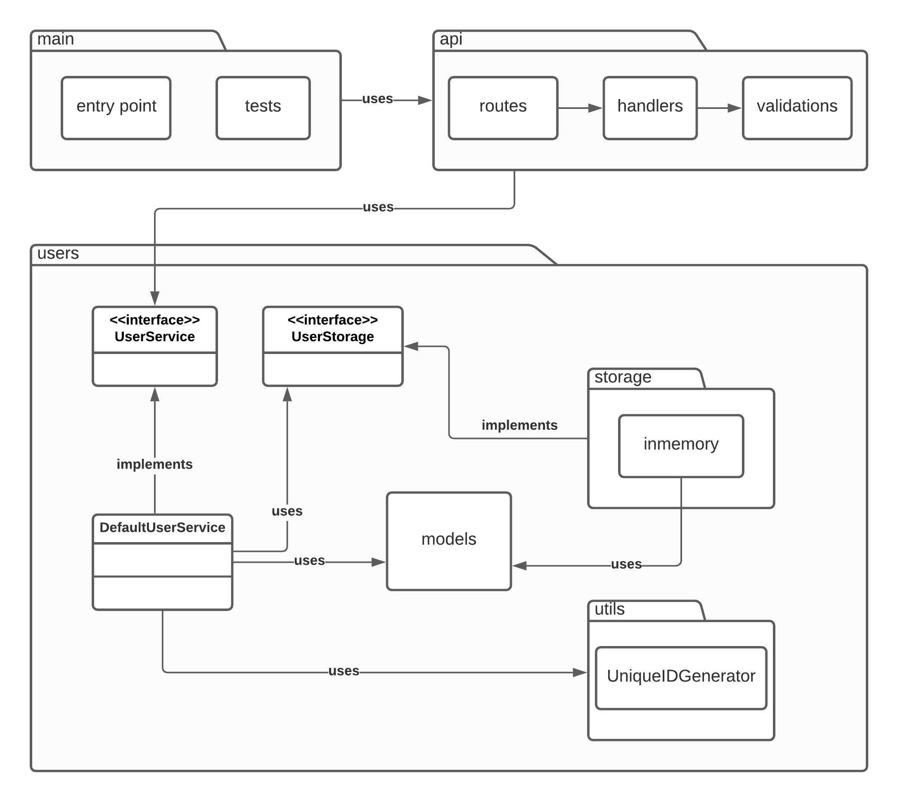

# user-management-service

Simple HTTP server that manages user data.

## Functionalities
1. __Create new user__. Given user email and name, it will return a created user with a unique system assigned user ID.
2. __Get user data__. Given a system assigned user ID, it will returns saved user data.
3. __Update user data__. Given a system assigned user ID, it will allow to change user attributes.

## Architecture


### Project layout
- _api/_ package is the interface of this service. It's where the http server is configured (routes, middlewares, etc)
- _user/_ it is a domain specific package that contains business regarding the management of users.

### Dependencies
- [Fiber](https://gofiber.io/): web framework used, an express like for Go.
- [Air](https://github.com/cosmtrek/air): for live reloading of the service during local development.

## Run locally

```sh
# install dependencies
go get ./...

# build, test and run
go build -v ./...
go test -v
go run main.go

## (optional) for live reloading

# install air
curl -sSfL https://raw.githubusercontent.com/cosmtrek/air/master/install.sh | sh -s -- -b $(go env GOPATH)/bin

# run
air

# if error 'air: command not found', then add to PATH and run again
export PATH=$PATH:$(go env GOPATH)/bin
```

## cURL commands

### Create new user
```sh
curl --request POST \
  --url http://localhost:8080/users \
  --header 'Content-Type: application/json' \
  --data '{
	"name": "Neymar",
	"email": "player@soccer.com"
}'
```

### Get user data
```sh
curl --request GET \
  --url http://localhost:8080/users/:userID
```

### Update user data
```sh
curl --request PATCH \
  --url http://localhost:8080/users/:userID \
  --header 'Content-Type: application/json' \
  --data '{
	"name": "Neymar da Silva Santos Junior"
}'
```

## TODO
- [ ] pentest the api.
- [ ] implement persistence storage with a real database. 
- [ ] implement a custom error handler.
- [ ] add swagger generation for the api.
- [ ] add correlation id for distributed tracing.
- [ ] add structured logging.
- [ ] add metrics.
- [ ] enhance testing with coverage analysis.
- [ ] refactor project layout to a more conventional one.
- [ ] authenticate calls, so that updating a user is only allowed to the creator.
- [ ] integrate with a configuration as a service to get secrets and other configs per environment.
- [ ] run performance tests, pprof and check race conditions.